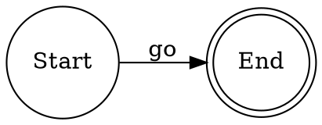
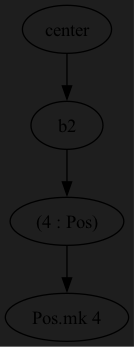
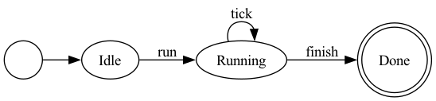

# Dot4: Graphviz DOT DSL for Lean 4

A type-safe DSL for generating [Graphviz DOT](https://graphviz.org/doc/info/lang.html) diagrams in Lean 4.

## Usage

```lean
import Dot4

open Dot4

def myGraph : Graph := dot {
  digraph "MyGraph"
  rankdir "LR"
  
  node "A" label="Start" shape="circle"
  node "B" label="End" shape="doublecircle"
  
  edge "A" → "B" label="go"
}

#eval IO.println myGraph.toDot
```

Output:


## Features

- **Type-safe DSL**: Define graphs using Lean syntax with compile-time checks
- **Unicode support**: Use `→` or `->` for edges
- **Flexible attributes**: Add any key-value attributes to nodes and edges
- **Graph/Digraph**: Support for both directed and undirected graphs

## Installation

Add to your `lakefile.toml`:

```toml
[[require]]
name = "Dot4"
git = "https://github.com/alok/Dot4"
rev = "main"
```

## Examples

### Macro Expansion Tree



```lean
def macroExpansionGraph : Graph := dot {
  digraph "MacroExpansion"
  rankdir "TB"
  bgcolor "#1e1e1e"

  node "n0" label="center"
  node "n1" label="b2"
  node "n2" label="(4 : Pos)"
  node "n3" label="Pos.mk 4"

  edge "n0" → "n1"
  edge "n1" → "n2"
  edge "n2" → "n3"
}
```

### State Machine



```lean
def stateMachine : Graph := dot {
  digraph "StateMachine"
  rankdir "LR"

  node "start" shape="circle" label=""
  node "s1" label="Idle"
  node "s2" label="Running"
  node "s3" label="Done" shape="doublecircle"

  edge "start" → "s1"
  edge "s1" → "s2" label="run"
  edge "s2" → "s2" label="tick"
  edge "s2" → "s3" label="finish"
}
```

## License

MIT
